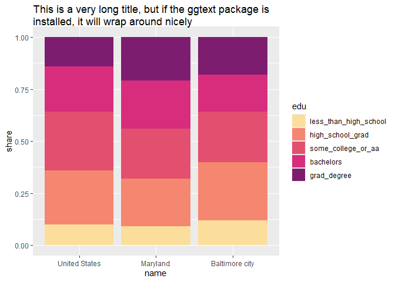

# Setting up your viz environment


This notebook should confirm that you have the packages you need to get
started for the class. Run code chunks individually, then render the
notebook, either by pressing a button (if in RStudio), choosing the
render command (if in Positron), or calling the quarto CLI
(`quarto render 01a_intro_viz/setup.qmd`). If this runs successfully,
you should have:

- a table with a footnote
- a stacked bar chart with a long wrapped title

``` r
# verify that `here` is installed and recognizes the project root
source(here::here("utils/helper_functions.R"))
```

``` r
library(dplyr)
```

    Warning: package 'dplyr' was built under R version 4.5.3

    Attaching package: 'dplyr'

    The following objects are masked from 'package:stats':

        filter, lag

    The following objects are masked from 'package:base':

        intersect, setdiff, setequal, union

``` r
library(ggplot2)
```

    Warning: package 'ggplot2' was built under R version 4.5.3

``` r
# subset of data to compare educational attainment for city, state, US
edu <- justviz::acs |>
  select(
    name,
    ages25plus,
    less_than_high_school,
    high_school_grad,
    some_college_or_aa,
    bachelors,
    grad_degree
  ) |>
  filter(name %in% c("United States", "Maryland", "Baltimore city"))

# make number formatting functions
comma <- scales::label_comma()
percent <- scales::label_percent()
```

``` r
edu |>
  # format number columns manually
  mutate(across(ages25plus, comma)) |>
  mutate(across(less_than_high_school:grad_degree, percent)) |>
  # convert column names to sentence case
  rename_with(snakecase::to_sentence_case) |>
  knitr::kable(align = "lrrrrrr") |>
  kableExtra::add_footnote(label = "This is a footnote to test kableExtra")
```

| Name | Ages 25 plus | Less than high school | High school grad | Some college or aa | Bachelors | Grad degree |
|:---|---:|---:|---:|---:|---:|---:|
| United States | 230,807,303 | 10% | 26% | 28% | 22% | 14% |
| Maryland | 4,301,335 | 9% | 23% | 24% | 23% | 21% |
| Baltimore city | 401,549 | 12% | 28% | 24% | 18% | 18% |

Educational attainment, 2024

**Note:** <sup>a</sup>This is a footnote to test kableExtra

``` r
edu |>
  gt::gt(rowname_col = "name") |>
  # format number columns through gt helpers
  gt::fmt_number(columns = ages25plus, decimals = 0) |>
  gt::fmt_percent(columns = less_than_high_school:grad_degree, decimals = 0) |>
  gt::cols_label_with(fn = snakecase::to_sentence_case)
```

<div id="ifiymevyrw" style="padding-left:0px;padding-right:0px;padding-top:10px;padding-bottom:10px;overflow-x:auto;overflow-y:auto;width:auto;height:auto;">
<style>#ifiymevyrw table {
  font-family: system-ui, 'Segoe UI', Roboto, Helvetica, Arial, sans-serif, 'Apple Color Emoji', 'Segoe UI Emoji', 'Segoe UI Symbol', 'Noto Color Emoji';
  -webkit-font-smoothing: antialiased;
  -moz-osx-font-smoothing: grayscale;
}
&#10;#ifiymevyrw thead, #ifiymevyrw tbody, #ifiymevyrw tfoot, #ifiymevyrw tr, #ifiymevyrw td, #ifiymevyrw th {
  border-style: none;
}
&#10;#ifiymevyrw p {
  margin: 0;
  padding: 0;
}
&#10;#ifiymevyrw .gt_table {
  display: table;
  border-collapse: collapse;
  line-height: normal;
  margin-left: auto;
  margin-right: auto;
  color: #333333;
  font-size: 16px;
  font-weight: normal;
  font-style: normal;
  background-color: #FFFFFF;
  width: auto;
  border-top-style: solid;
  border-top-width: 2px;
  border-top-color: #A8A8A8;
  border-right-style: none;
  border-right-width: 2px;
  border-right-color: #D3D3D3;
  border-bottom-style: solid;
  border-bottom-width: 2px;
  border-bottom-color: #A8A8A8;
  border-left-style: none;
  border-left-width: 2px;
  border-left-color: #D3D3D3;
}
&#10;#ifiymevyrw .gt_caption {
  padding-top: 4px;
  padding-bottom: 4px;
}
&#10;#ifiymevyrw .gt_title {
  color: #333333;
  font-size: 125%;
  font-weight: initial;
  padding-top: 4px;
  padding-bottom: 4px;
  padding-left: 5px;
  padding-right: 5px;
  border-bottom-color: #FFFFFF;
  border-bottom-width: 0;
}
&#10;#ifiymevyrw .gt_subtitle {
  color: #333333;
  font-size: 85%;
  font-weight: initial;
  padding-top: 3px;
  padding-bottom: 5px;
  padding-left: 5px;
  padding-right: 5px;
  border-top-color: #FFFFFF;
  border-top-width: 0;
}
&#10;#ifiymevyrw .gt_heading {
  background-color: #FFFFFF;
  text-align: center;
  border-bottom-color: #FFFFFF;
  border-left-style: none;
  border-left-width: 1px;
  border-left-color: #D3D3D3;
  border-right-style: none;
  border-right-width: 1px;
  border-right-color: #D3D3D3;
}
&#10;#ifiymevyrw .gt_bottom_border {
  border-bottom-style: solid;
  border-bottom-width: 2px;
  border-bottom-color: #D3D3D3;
}
&#10;#ifiymevyrw .gt_col_headings {
  border-top-style: solid;
  border-top-width: 2px;
  border-top-color: #D3D3D3;
  border-bottom-style: solid;
  border-bottom-width: 2px;
  border-bottom-color: #D3D3D3;
  border-left-style: none;
  border-left-width: 1px;
  border-left-color: #D3D3D3;
  border-right-style: none;
  border-right-width: 1px;
  border-right-color: #D3D3D3;
}
&#10;#ifiymevyrw .gt_col_heading {
  color: #333333;
  background-color: #FFFFFF;
  font-size: 100%;
  font-weight: normal;
  text-transform: inherit;
  border-left-style: none;
  border-left-width: 1px;
  border-left-color: #D3D3D3;
  border-right-style: none;
  border-right-width: 1px;
  border-right-color: #D3D3D3;
  vertical-align: bottom;
  padding-top: 5px;
  padding-bottom: 6px;
  padding-left: 5px;
  padding-right: 5px;
  overflow-x: hidden;
}
&#10;#ifiymevyrw .gt_column_spanner_outer {
  color: #333333;
  background-color: #FFFFFF;
  font-size: 100%;
  font-weight: normal;
  text-transform: inherit;
  padding-top: 0;
  padding-bottom: 0;
  padding-left: 4px;
  padding-right: 4px;
}
&#10;#ifiymevyrw .gt_column_spanner_outer:first-child {
  padding-left: 0;
}
&#10;#ifiymevyrw .gt_column_spanner_outer:last-child {
  padding-right: 0;
}
&#10;#ifiymevyrw .gt_column_spanner {
  border-bottom-style: solid;
  border-bottom-width: 2px;
  border-bottom-color: #D3D3D3;
  vertical-align: bottom;
  padding-top: 5px;
  padding-bottom: 5px;
  overflow-x: hidden;
  display: inline-block;
  width: 100%;
}
&#10;#ifiymevyrw .gt_spanner_row {
  border-bottom-style: hidden;
}
&#10;#ifiymevyrw .gt_group_heading {
  padding-top: 8px;
  padding-bottom: 8px;
  padding-left: 5px;
  padding-right: 5px;
  color: #333333;
  background-color: #FFFFFF;
  font-size: 100%;
  font-weight: initial;
  text-transform: inherit;
  border-top-style: solid;
  border-top-width: 2px;
  border-top-color: #D3D3D3;
  border-bottom-style: solid;
  border-bottom-width: 2px;
  border-bottom-color: #D3D3D3;
  border-left-style: none;
  border-left-width: 1px;
  border-left-color: #D3D3D3;
  border-right-style: none;
  border-right-width: 1px;
  border-right-color: #D3D3D3;
  vertical-align: middle;
  text-align: left;
}
&#10;#ifiymevyrw .gt_empty_group_heading {
  padding: 0.5px;
  color: #333333;
  background-color: #FFFFFF;
  font-size: 100%;
  font-weight: initial;
  border-top-style: solid;
  border-top-width: 2px;
  border-top-color: #D3D3D3;
  border-bottom-style: solid;
  border-bottom-width: 2px;
  border-bottom-color: #D3D3D3;
  vertical-align: middle;
}
&#10;#ifiymevyrw .gt_from_md > :first-child {
  margin-top: 0;
}
&#10;#ifiymevyrw .gt_from_md > :last-child {
  margin-bottom: 0;
}
&#10;#ifiymevyrw .gt_row {
  padding-top: 8px;
  padding-bottom: 8px;
  padding-left: 5px;
  padding-right: 5px;
  margin: 10px;
  border-top-style: solid;
  border-top-width: 1px;
  border-top-color: #D3D3D3;
  border-left-style: none;
  border-left-width: 1px;
  border-left-color: #D3D3D3;
  border-right-style: none;
  border-right-width: 1px;
  border-right-color: #D3D3D3;
  vertical-align: middle;
  overflow-x: hidden;
}
&#10;#ifiymevyrw .gt_stub {
  color: #333333;
  background-color: #FFFFFF;
  font-size: 100%;
  font-weight: initial;
  text-transform: inherit;
  border-right-style: solid;
  border-right-width: 2px;
  border-right-color: #D3D3D3;
  padding-left: 5px;
  padding-right: 5px;
}
&#10;#ifiymevyrw .gt_stub_row_group {
  color: #333333;
  background-color: #FFFFFF;
  font-size: 100%;
  font-weight: initial;
  text-transform: inherit;
  border-right-style: solid;
  border-right-width: 2px;
  border-right-color: #D3D3D3;
  padding-left: 5px;
  padding-right: 5px;
  vertical-align: top;
}
&#10;#ifiymevyrw .gt_row_group_first td {
  border-top-width: 2px;
}
&#10;#ifiymevyrw .gt_row_group_first th {
  border-top-width: 2px;
}
&#10;#ifiymevyrw .gt_summary_row {
  color: #333333;
  background-color: #FFFFFF;
  text-transform: inherit;
  padding-top: 8px;
  padding-bottom: 8px;
  padding-left: 5px;
  padding-right: 5px;
}
&#10;#ifiymevyrw .gt_first_summary_row {
  border-top-style: solid;
  border-top-color: #D3D3D3;
}
&#10;#ifiymevyrw .gt_first_summary_row.thick {
  border-top-width: 2px;
}
&#10;#ifiymevyrw .gt_last_summary_row {
  padding-top: 8px;
  padding-bottom: 8px;
  padding-left: 5px;
  padding-right: 5px;
  border-bottom-style: solid;
  border-bottom-width: 2px;
  border-bottom-color: #D3D3D3;
}
&#10;#ifiymevyrw .gt_grand_summary_row {
  color: #333333;
  background-color: #FFFFFF;
  text-transform: inherit;
  padding-top: 8px;
  padding-bottom: 8px;
  padding-left: 5px;
  padding-right: 5px;
}
&#10;#ifiymevyrw .gt_first_grand_summary_row {
  padding-top: 8px;
  padding-bottom: 8px;
  padding-left: 5px;
  padding-right: 5px;
  border-top-style: double;
  border-top-width: 6px;
  border-top-color: #D3D3D3;
}
&#10;#ifiymevyrw .gt_last_grand_summary_row_top {
  padding-top: 8px;
  padding-bottom: 8px;
  padding-left: 5px;
  padding-right: 5px;
  border-bottom-style: double;
  border-bottom-width: 6px;
  border-bottom-color: #D3D3D3;
}
&#10;#ifiymevyrw .gt_striped {
  background-color: rgba(128, 128, 128, 0.05);
}
&#10;#ifiymevyrw .gt_table_body {
  border-top-style: solid;
  border-top-width: 2px;
  border-top-color: #D3D3D3;
  border-bottom-style: solid;
  border-bottom-width: 2px;
  border-bottom-color: #D3D3D3;
}
&#10;#ifiymevyrw .gt_footnotes {
  color: #333333;
  background-color: #FFFFFF;
  border-bottom-style: none;
  border-bottom-width: 2px;
  border-bottom-color: #D3D3D3;
  border-left-style: none;
  border-left-width: 2px;
  border-left-color: #D3D3D3;
  border-right-style: none;
  border-right-width: 2px;
  border-right-color: #D3D3D3;
}
&#10;#ifiymevyrw .gt_footnote {
  margin: 0px;
  font-size: 90%;
  padding-top: 4px;
  padding-bottom: 4px;
  padding-left: 5px;
  padding-right: 5px;
}
&#10;#ifiymevyrw .gt_sourcenotes {
  color: #333333;
  background-color: #FFFFFF;
  border-bottom-style: none;
  border-bottom-width: 2px;
  border-bottom-color: #D3D3D3;
  border-left-style: none;
  border-left-width: 2px;
  border-left-color: #D3D3D3;
  border-right-style: none;
  border-right-width: 2px;
  border-right-color: #D3D3D3;
}
&#10;#ifiymevyrw .gt_sourcenote {
  font-size: 90%;
  padding-top: 4px;
  padding-bottom: 4px;
  padding-left: 5px;
  padding-right: 5px;
}
&#10;#ifiymevyrw .gt_left {
  text-align: left;
}
&#10;#ifiymevyrw .gt_center {
  text-align: center;
}
&#10;#ifiymevyrw .gt_right {
  text-align: right;
  font-variant-numeric: tabular-nums;
}
&#10;#ifiymevyrw .gt_font_normal {
  font-weight: normal;
}
&#10;#ifiymevyrw .gt_font_bold {
  font-weight: bold;
}
&#10;#ifiymevyrw .gt_font_italic {
  font-style: italic;
}
&#10;#ifiymevyrw .gt_super {
  font-size: 65%;
}
&#10;#ifiymevyrw .gt_footnote_marks {
  font-size: 75%;
  vertical-align: 0.4em;
  position: initial;
}
&#10;#ifiymevyrw .gt_asterisk {
  font-size: 100%;
  vertical-align: 0;
}
&#10;#ifiymevyrw .gt_indent_1 {
  text-indent: 5px;
}
&#10;#ifiymevyrw .gt_indent_2 {
  text-indent: 10px;
}
&#10;#ifiymevyrw .gt_indent_3 {
  text-indent: 15px;
}
&#10;#ifiymevyrw .gt_indent_4 {
  text-indent: 20px;
}
&#10;#ifiymevyrw .gt_indent_5 {
  text-indent: 25px;
}
&#10;#ifiymevyrw .katex-display {
  display: inline-flex !important;
  margin-bottom: 0.75em !important;
}
&#10;#ifiymevyrw div.Reactable > div.rt-table > div.rt-thead > div.rt-tr.rt-tr-group-header > div.rt-th-group:after {
  height: 0px !important;
}
</style>

|  | Ages 25 plus | Less than high school | High school grad | Some college or aa | Bachelors | Grad degree |
|----|----|----|----|----|----|----|
| United States | 230,807,303 | 10% | 26% | 28% | 22% | 14% |
| Maryland | 4,301,335 | 9% | 23% | 24% | 23% | 21% |
| Baltimore city | 401,549 | 12% | 28% | 24% | 18% | 18% |

Educational attainment, 2024 {.gt_table quarto-postprocess="true"
quarto-disable-processing="false" quarto-bootstrap="false"}

</div>

If some junk shows up in brackets with the second table’s caption,
that’s fine. The `gt` package is geared towards HTML and PDF output
anyway.

``` r
# assign plot to a variable so we can test exporting it
edu_plot <- edu |>
  select(-ages25plus) |>
  # reshape to long format for plotting
  tidyr::pivot_longer(-name, names_to = "edu", values_to = "share") |>
  # convert to factor so levels stay in correct order
  mutate(across(c(name, edu), forcats::as_factor)) |>
  ggplot(aes(x = name, y = share, fill = edu)) +
  geom_col(position = position_fill(reverse = TRUE)) +
  rcartocolor::scale_fill_carto_d(palette = "SunsetDark") +
  labs(
    title = "This is a very long title, but if the ggtext package is installed, it will wrap around nicely"
  ) +
  theme(plot.title = ggtext::element_textbox_simple(height = unit(2, "lines")))

edu_plot
```



``` r
# verify that we can write a plot out to png & svg
# use `here` to write in the same folder as this notebook
ggsave(here::here("01a_intro_viz/edu_stacked_bars.png"), edu_plot, bg = "white")
```

    Saving 7 x 5 in image

``` r
ggsave(here::here("01a_intro_viz/edu_stacked_bars.svg"), edu_plot)
```

    Saving 7 x 5 in image


